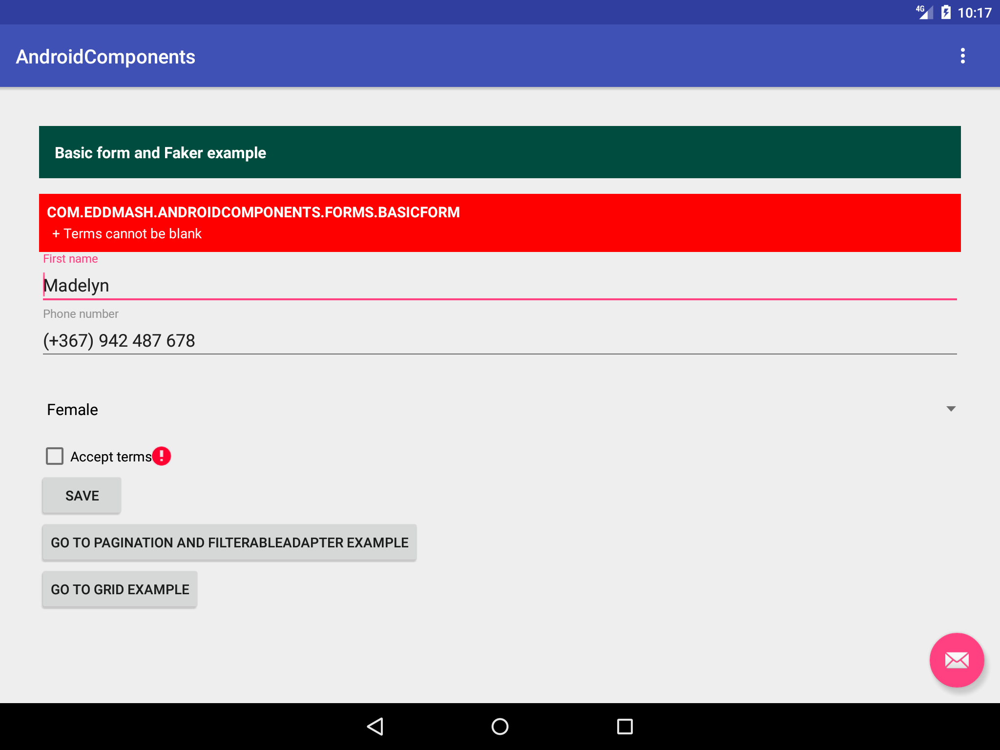

.. Android Forms documentation master file, created by
   sphinx-quickstart on Wed Feb  7 15:36:05 2018.
   You can adapt this file completely to your liking, but it should at least
   contain the root `toctree` directive.

Welcome to Android Forms documentation!
=========================================

.. toctree::
   :maxdepth: 1
   :caption: Contents:

This library makes it easy to deal with views, especially if dealing with a large amount of views.

It provide a consistent and fluent way of setting, validating, retrieving and saving values from
views.

With this library you not have to change or alter you layout in anyway, but you will be able to
work with multiple forms on multiple fragments via :doc:`FormCollection<form_collection>`.

The library also comes an inbuilt :doc:`Data populator <faker>` to use when developing. This comes
in handy when you want to prepopulate you form with sample data.

For validation the `Validation <http://android-validation-library.readthedocs.io>`_ is used.

.. toctree::
    :titlesonly:
    :maxdepth: 1

    introduction
    Collection Form <form_collection>
    Faker - data populator <faker>