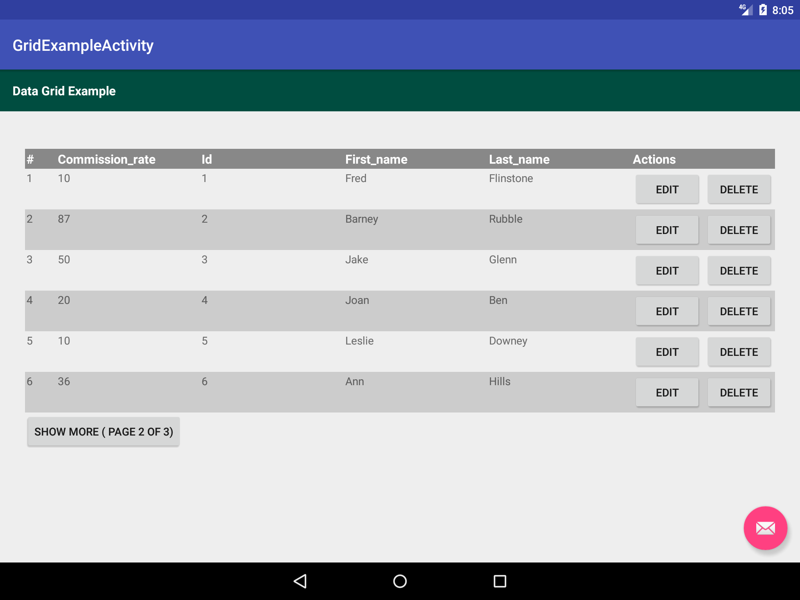

DataGridView Documentation
==========================

DataGridView can be used to display a list or table of data records providing features like
pagination.

Its takes a List of Maps that contains data and renders each row using a set
of :java:ref:`ColumnInterface <ColumnInterface>` presenting data in the form of a table.

Install
-------

Using maven::

    <dependency>
      <groupId>com.eddmash</groupId>
      <artifactId>android-grids</artifactId>
      <version>1.0.2</version>
      <type>pom</type>
    </dependency>

Using gradle::

    compile 'com.eddmash:android-grids:1.0.2'

Usage
-----

The minimal code needed to use DataGridView is as follows

.. code-block:: java

    dataGridView = (DataGridView) findViewById(R.id.data_view);
    dataGridView.setPageSize(3);
    List<Map> data = "...";
    dataGridView.setData(data);

Its also possible to override which columns are used in the grid and customize those columns as
one wishes.

Assuming in the data provided to the DataGridView looks like this

.. code-block:: java

    [{"first_name":"jake", "age":"4"}, {"first_name":"joan", "age":"6"}, ]

Show specific columns
---------------------

The earlier example will render both the firstname and age column on the grid we can tell the
DataGridView to only render the firstname
by :java:ref:`setColumns(Map) <DataGridView.setColumns(Map)` as shown below:

.. code-block:: java

     Map cols = new HashMap();
     cols.put("first_name", new Column(this,"first_name","First Name"));
     dataGridView.setColumns(cols);

Add columns
-----------

On top of columns that relate to the data prodided, with DataGridView you have the ability to
:java:ref:`addColumn(BaseColumn, boolean) <DataGridView.addColumn(BaseColumn, boolean)>`
e.g. action columns, serial columns or your own custom columns.

.. code-block:: java

    dataGridView.addColumn(new SerialColumn(this, "#"), DataGridView.LEFT);
    dataGridView.addColumn(new EditActionColumn(this, "Edit"), DataGridView.RIGHT);
    dataGridView.addColumn(new DeleteActionColumn(this, "Delete"), DataGridView.RIGHT);

Learn more about columns :doc:`Columns <columns>`

.. toctree::
    :titlesonly:
    :maxdepth: 1

    columns <columns>